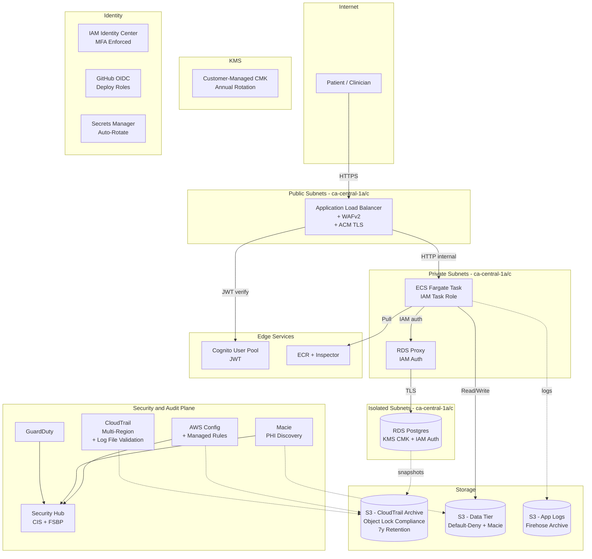
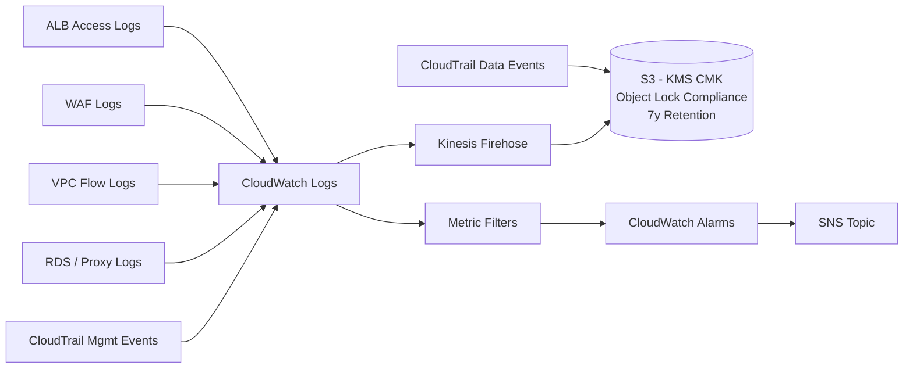

## Summary

Build a single-account AWS reference architecture as an interview-prep portfolio piece for a Security & Compliance Lead role at a Canadian HealthTech. The repo will hold Terraform for a sample health-summary API in `ca-central-1`, a 15-control matrix mapping every technical control to PHIPA / PIPEDA / Quebec Law 25, an incident response runbook, and a top-level README written for a non-technical exec. Near-$0 cost: Terraform-only (validated with `terraform plan`; the one-time `terraform-bootstrap` is the only step that touches a real AWS account and runs at ~$1-5/mo for the S3 state bucket + DynamoDB lock table + KMS CMK); public GitHub repo for shareability.

## Problem Frame

The user has an interview lined up for a Security, Infrastructure & Compliance Lead at NiaHealth, a Toronto-based HealthTech. The role's top requirements — hands-on technical compliance in a regulated data environment, comfort inspecting cloud infrastructure / access models / CI/CD / incident response, and Canadian privacy framework familiarity (PHIPA, PIPEDA, Quebec Law 25) — are best demonstrated with a working portfolio piece, not a resume bullet. The user wants a 1-2 week MVP, free to build, that an interviewer can read after the call and that the user can walk through with confidence in a 30-min technical round.

---

## Requirements

### Architecture and data residency

- R1. All infrastructure lives in a single AWS account in `ca-central-1` (Montreal). No US regions for PHI; cross-region only for KMS-encrypted backups to `ca-west-1` (Calgary).
- R2. Every PHI-bearing resource (RDS, S3, EBS, CloudWatch Logs) is encrypted at rest via a customer-managed KMS CMK with annual automatic rotation.
- R3. All data-plane traffic terminates TLS 1.2+ at the ALB; ACM-managed certificate; HSTS enabled.
- R4. The sample API runs in private subnets; private subnets reach AWS services (S3, KMS, Secrets Manager, ECR, CloudWatch Logs) via VPC endpoints — no public internet for PHI paths.
- R5. ALB sits in public subnets with WAFv2 attached (AWS Managed Rules: Common + Known Bad Inputs).

### Identity and access

- R6. All human access goes through IAM Identity Center with MFA enforced; no IAM users except one break-glass.
- R7. CI uses GitHub Actions OIDC to assume a per-environment deploy role; no long-lived AWS access keys in the repo, in secrets, or in CI. The OIDC trust policy pins the `sub` claim to `repo:<org>/<repo>:ref:refs/heads/main` and `workflow_file:infra/.github/workflows/apply.yml`, with `aud: sts.amazonaws.com`.
- R8. Every service has a least-privilege IAM role (task role, RDS Proxy role, etc.) with permissions scoped to specific resource ARNs.
- R9. All secrets (DB credentials, third-party API keys) live in AWS Secrets Manager with rotation; nothing in env vars or committed config.

### Logging, monitoring, and audit posture

- R10. CloudTrail multi-region trail with KMS-encrypted log files, log file integrity validation, and CloudWatch Logs integration.
- R11. CloudTrail logs archived to S3 with Object Lock in Compliance mode, 7-year retention, lifecycle transition to Glacier Instant Retrieval after 90 days.
- R12. AWS Config with managed rules covering encrypted-at-rest, no-public-bucket, MFA-root, RDS-encrypted, RDS-public-access, CloudTrail-encryption, and IAM-access-key.
- R13. Amazon GuardDuty enabled in `ca-central-1` with S3 Protection and Malware Protection for ECS plans on.
- R14. AWS Security Hub enabled with CIS AWS Foundations Benchmark v3.0 and AWS Foundational Security Best Practices standards.
- R15. Amazon Macie enabled with a daily discovery job on the data-tier S3 bucket; findings flow to Security Hub.

### Data tier

- R16. RDS for PostgreSQL with storage encryption, `iam_database_authentication_enabled = true`, `deletion_protection = true`, automated backups retained 35 days, TLS-only enforced via a custom parameter group.
- R17. RDS Proxy in front of RDS for IAM-based connection pooling and credential rotation.
- R18. The data-tier S3 bucket has all four public-access blocks on; KMS CMK-encrypted; versioning on.
- R19. S3 Lifecycle rule transitions objects to Glacier Instant Retrieval after 90 days; expires after 7 years (PIPEDA-aligned retention).

### Sample application

- R20. A sample 3-tier health-summary REST API demonstrating the controls: Cognito User Pool (JWT), business logic in ECS Fargate, persistence in RDS Postgres through RDS Proxy.
- R21. The sample app has a "subject access request" endpoint (PIPEDA 4.9 / Quebec Law 25) and a "delete my data" endpoint; both write to the immutable audit log.
- R22. Container images are scanned by Amazon Inspector on push to ECR; critical/high CVEs block deploy.

### CI/CD and policy-as-code

- R23. GitHub Actions workflow `plan.yml` runs on every PR: terraform fmt + init + validate + plan + Checkov scan + tflint + OPA/Conftest; outputs plan to PR comment; SARIF to Code Scanning.
- R24. GitHub Actions workflow `apply.yml` runs on merge to `main`: requires manual approval from a CODEOWNER; uses the OIDC deploy role; tags the commit with the apply timestamp.
- R25. Checkov is the primary policy-as-code tool; rules extend the default CIS + HIPAA mappings with custom checks for the 15 controls.
- R26. OPA/Conftest enforces tagging and naming policies (`Environment`, `DataClass`, `Owner`); tflint enforces style and module structure.

### Documentation (the centerpiece)

- R27. `CONTROLS.md` matrix in repo root: rows = 15 controls; columns = PHIPA clause, PIPEDA principle, Quebec Law 25 article, control implementation (Terraform resource), evidence (CloudTrail query, Config rule ARN, etc.).
- R28. `RUNBOOKS/breach-rds-snapshot-leak.md` walks the canonical health-tech breach scenario (RDS snapshot leaked to public S3) with timeline, decisions, regulator-notification templates for IPC (PHIPA), OPC (PIPEDA), and CAI (Quebec Law 25), and post-incident action items.
- R29. `README.md` has an exec-level summary, an architecture diagram (mermaid), the threat model in 5-7 STRIDE bullets, and a "How to read this repo" section.

---

## Key Technical Decisions

- KTD1. **Single AWS account in `ca-central-1`:** Lean MVP scope. Multi-account Organizations + Control Tower would be the right answer for a real HealthTech at scale, but the interview-pitch story for "I can do this from a standing start in 1-2 weeks" is stronger with a focused single-account. The Terraform structure (per-layer modules, OIDC-only deploy roles, Checkov gating) is multi-account-ready, so a future scale-out is a `terraform apply` away, not a rewrite.
- KTD2. **ECS Fargate over Lambda for the sample app:** ECS Fargate exposes every control an interviewer probes (VPC isolation, security group layering, IAM task role, KMS at-rest, Secrets rotation, CloudWatch alarms, VPC Flow Logs, ALB access logs). The Lambda variant is defensible only for async or event-driven stories (HL7 ingestion, FHIR transforms) and loses 3-4 of those control touchpoints. Cost delta (~$70-120/mo vs. ~$15-40/mo) is irrelevant in terraform-only mode.
- KTD3. **Checkov over tfsec for policy-as-code:** tfsec is OSS-frozen (absorbed into Palo Alto's Prisma Cloud); Checkov is actively maintained, has the best HIPAA control mappings, and outputs SARIF for native GitHub Code Scanning integration. OPA/Conftest is layered on top for tagging and naming, tflint for style — three tools, three jobs, no overlap.
- KTD4. **`terraform-aws-modules` as building blocks, not fork:** Anton Babenko's modules are the community default; forking them loses interview credibility ("why didn't you just use the standard?"). Internal modules wrap them with naming and tagging standards and provide a single seam for the 15 custom controls.
- KTD5. **OIDC-only deploy roles:** GitHub Actions assumes `terraform-apply-dev` and `terraform-apply-prod` via OIDC; no static AWS keys. This is the 2025-2026 default and the right answer to "how do you handle CI credentials."
- KTD6. **Object Lock Compliance mode (not Governance) for audit log retention:** Compliance mode prevents root account from deleting logs before retention — the difference between "logs survive an insider" and "logs survive a regulator subpoena for 7 years." Retention is set higher than current PIPEDA guidance so future guidance changes don't force a re-architecture.
- KTD7. **Drop CloudTrail Lake and AWS Audit Manager; restrict CloudWatch Logs fan-in to keep the cost profile at ~$0:** CloudTrail Lake closed 2026-05-31 and AWS Audit Manager closed 2026-04-30 — verified against AWS What's New at planning date 2026-06-23; re-verify at interview time if more than 30 days have elapsed. CloudTrail **data events** fan into S3 directly (high volume, expensive as CW Logs data); CloudTrail **management events** and the structured log streams (VPC Flow Logs, ALB access logs, WAF logs, RDS/Proxy logs) go through CloudWatch Logs. Ad-hoc queries use Athena over S3. This is the more portable answer: "works without depending on a service that just shut down new signups, and stays inside the free tier."
- KTD8. **Region split: `ca-central-1` primary, `ca-west-1` for backups only:** Calgary launched Dec 2023 and is the newer region; Montreal is the more common primary. Quebec Law 25 §28.1 (cross-border express consent) makes "primary in US" a non-starter, so even if `us-east-1` is cheaper or has a specific service, PHI never touches it. Cross-region replication is to `ca-west-1` (Calgary, also in Canada), not US.
- KTD9. **Terraform-only with `terraform plan` output committed as proof:** The repo includes a `plan-output.txt` checked into `docs/architecture/` (sanitized: account IDs redacted, ARNs scrubbed) showing the terraform plan succeeded. The one exception is the bootstrap path: a `terraform-bootstrap` one-time script creates the S3 state bucket (KMS-encrypted, all 4 public-access blocks on, versioning on, Object Lock Compliance) and DynamoDB lock table — without this, the rest of the plan cannot run `terraform init`. The bootstrap is the only step that touches a real AWS account and runs at ~$1-5/mo. An alternative `-backend=false` path runs `terraform init -backend=false && terraform validate && terraform plan` purely against the local filesystem for the strictly-demo case. The CI workflow includes an explicit "do not apply" guard.
- KTD10. **PHIPA + PIPEDA + Quebec Law 25 as the control frameworks, no HIPAA:** AWS publishes HIPAA reference architecture but nothing for PHIPA or Law 25. The `CONTROLS.md` matrix is the project's primary deliverable because it does the cross-walk that AWS itself hasn't. Citing HIPAA mappings where the control is equivalent is fine, but the matrix is anchored to Canadian frameworks, the JD's "big plus."

---

## High-Level Technical Design

### Architecture topology (single AWS account, `ca-central-1`)

### Centralized logging fan-in

### Control-to-framework matrix (preview; full version in `CONTROLS.md`)

| Control | PHIPA | PIPEDA | Qc Law 25 | Tech implementation |
|---|---|---|---|---|
| C1 Encryption at rest | s.12, O.Reg.329/04 | 4.7 | s.28 | `aws_kms_key` per data class, `storage_encrypted = true` on RDS, `server_side_encryption_configuration` on S3 |
| C2 Encryption in transit | s.12, O.Reg.329/04 | 4.7 | s.28 | ALB `ssl_policy = ELBSecurityPolicy-TLS13-1-2-2021-06`, ACM cert, HSTS |
| C3 MFA + identity | O.Reg.329/04 | 4.7 | s.3 | IAM Identity Center + WebAuthn; one break-glass IAM user with MFA |
| C4 Least-privilege | s.12 | 4.1, 4.7 | s.3.1 | Per-service IAM roles, permission boundaries, IAM Access Analyzer |
| C5 Immutable audit | O.Reg.329/04 | 4.7 | breach-investigation | CloudTrail + S3 Object Lock Compliance, 7y |
| C6 VPC isolation | s.12 | 4.7 | s.28 | Private subnets, VPC endpoints (no NAT for PHI paths) |
| C7 PII discovery | O.Reg.329/04 | 4.7 | s.28 | Macie daily discovery job on data-tier bucket |
| C8 Threat detection | s.12 | 4.7 | n/a | GuardDuty (S3 + Malware plans) |
| C9 Centralized posture | s.12 | 4.1, 4.7 | s.3.1 | Security Hub (CIS + FSBP) |
| C10 Config compliance | s.12, O.Reg.329/04 | 4.7 | s.3.1 | AWS Config + managed rules |
| C11 Data retention | n/a | 4.5 | s.28 | S3 Lifecycle 90d to IA, 7y expire; RDS snapshot 35d |
| C12 Breach automation | s.13 | 4.7 (safeguards), s.10.1 (breach reporting to OPC) | s.3.1, s.28.1 | EventBridge on GuardDuty high-sev to SNS + 72h timer |
| C13 Secrets | s.12 | 4.7 | n/a | Secrets Manager with auto-rotate Lambda |
| C14 Consent trail | s.18 (consent generally), s.20 (express consent) | 4.3, 4.8 | s.28.1 | App writes consent receipts to S3 (immutable) |
| C15 Right-to-access/delete | n/a | 4.9 | s.28 | API endpoints + audit log entry |

---

## Scope Boundaries

### In scope

- Terraform for a single AWS account in `ca-central-1`, validated with `terraform plan` (no real `terraform apply`).
- ECS Fargate + ALB + RDS Postgres sample health-summary REST API (in `app/`).
- 15-control mapping to PHIPA / PIPEDA / Quebec Law 25 in `CONTROLS.md`.
- Incident response runbook for one canonical scenario (RDS snapshot to public S3).
- CI/CD with OIDC, Checkov, tflint, OPA/Conftest, plan-on-PR, gated-apply-on-main.
- Public GitHub repo with polished README, architecture diagram, threat model.

### Deferred to Follow-Up Work (for a "Substantial" tier expansion, 4-6 weeks)

- Multi-account AWS Organizations with Control Tower and SCPs.
- Audit Manager-style evidence collection automation (Audit Manager itself is closed to new customers as of 2026-04-30).
- Cross-region active-active in `ca-west-1` (Calgary) for DR.
- Two to three additional incident response runbooks (insider breach, vendor compromise, ransomware).
- FHIR / HL7 integration sample (cite `aws-samples/fhir-hl7v2-integration-transform` as the path).
- SOC 2 / HITRUST CSF v11 evidence collection pipeline.
- Privacy Impact Assessment (PIA) automation per Quebec Law 25 §21.
- Scheduled drift detection (e.g., `drift.yml` running `terraform plan -detailed-exitcode`) — intentionally out of scope for the MVP; the natural first follow-up once the OIDC deploy role and state backend are stable.
- Cross-region DR runbook for `ca-west-1` (Calgary) restore — acknowledged in KTD8 but not runbook-documented in MVP; cross-region `aws_s3_bucket_replication_configuration` and KMS re-encryption steps deferred. A future runbook (`RUNBOOKS/region-outage-restore-from-ca-west-1.md`) would cover detection, decision criteria, snapshot copy, DNS/ALB switch, RTO/RPO documentation.

### Outside this product's identity

- A live deployment with real PHI. This is interview prep, not a real platform.
- HIPAA-specific mappings. Canadian frameworks are the JD's "big plus"; HIPAA is a US framework and not what NiaHealth needs.
- Detailed lawyer-grade legal analysis of the framework clauses. The matrix cites clauses; it is not legal advice. (Note in README.)

---

## Implementation Units

### U1. Repo skeleton + top-level README + threat model + architecture diagram

- **Goal:** Establish the public face of the project. By the end of this unit, a fresh visitor can land on the repo, see what the project is, see the architecture, and know how to navigate.
- **Requirements:** R29
- **Files:** `README.md`, `LICENSE`, `THREAT_MODEL.md`, `docs/architecture/architecture.mmd`, `docs/architecture/logging-fan-in.mmd`, `.gitignore`, `CONTRIBUTING.md`, `CODEOWNERS`
- **Approach:** README is structured as: 30-second elevator pitch, 60-second architecture diagram, "What this proves in an interview," "How to read this repo," and "What this is NOT" (terraform-only, no real PHI, not legal advice). Threat model is a STRIDE-per-element table (5-7 rows max) that names the threats and points to the control(s) addressing them. Render PNGs via `mmdc -i ... -o ...` in a one-shot script in `infra/scripts/render-architecture.sh` (owned by U2, not U1's `scripts/`).
- **Patterns to follow:** The two architecture mermaid diagrams in the High-Level Technical Design section above are the source of truth — copy them into `docs/architecture/architecture.mmd` and `docs/architecture/logging-fan-in.mmd`. PNG rendering is done by `infra/scripts/render-architecture.sh` (owned by U2).
- **Test scenarios:**
  - README renders correctly on GitHub and in a local markdown viewer.
  - The architecture mermaid diagram renders in GitHub's mermaid viewer without errors.
  - The threat model table is internally consistent (every threat links to a control ID that exists in `CONTROLS.md`).
  - The "What this is NOT" section explicitly disclaims no live deployment, no real PHI, not legal advice.
- **Verification:** A first-time visitor can answer (a) what the project is, (b) what it proves, (c) what's in scope and out, in under 2 minutes of reading.

### U2. Terraform foundation: state, providers, OIDC deploy role, module structure, policy tooling

- **Goal:** Lay the terraform groundwork so any subsequent unit has a working `terraform init && terraform validate && terraform plan` loop, and the CI pipeline has a deploy role to assume.
- **Requirements:** R7, R23, R24, R25, R26
- **Files:** `infra/versions.tf`, `infra/providers.tf`, `infra/backend.tf`, `infra/Makefile`, `infra/main.tf`, `infra/modules/landing/{main,variables,outputs,iam,oidc,checkov,conftest}.tf`, `infra/policies/checkov.yaml`, `infra/policies/conftest.rego`, `infra/policies/tflint.hcl`, `infra/scripts/render-architecture.sh`
- **Approach:** Use `terraform-aws-modules`-style per-layer module structure (Anton Babenko convention), with all external modules pinned to a specific tag (e.g., `?ref=v5.50.0`) to control supply-chain risk. State backend is S3 + DynamoDB in a real `niahealth-state` bucket created via a one-time `terraform-bootstrap` script that the user runs locally (documented in `infra/README.md`); the bootstrap creates the bucket with a KMS CMK (not AWS-managed), all 4 public-access blocks on, versioning on, Object Lock Compliance, and a bucket policy allowing only the OIDC deploy role + a human admin principal with `aws:MultiFactorAuthPresent`. Providers pinned via `versions.tf` (`hashicorp/aws ~> 5.50`, `hashicorp/tls ~> 4.0`); `.terraform.lock.hcl` is committed. OIDC deploy role is created via `terraform-aws-modules/github-oidc-provider/aws` and `terraform-aws-modules/iam/aws//modules/iam-github-roles` with a trust policy that pins `sub: repo:<org>/<repo>:ref:refs/heads/main`, `workflow_file: infra/.github/workflows/apply.yml`, and `aud: sts.amazonaws.com`. Checkov config extends the `BC_AWS_GENERAL_https` baseline with custom skips for documented false positives. Conftest enforces the 3 required tags (`Environment`, `DataClass`, `Owner`). tflint config enables AWS plugin + naming convention rules. The committed `plan-output.txt` artifact is sanitized by `scripts/sanitize-plan.sh` (redact account IDs, scrub ARNs) before any commit.
- **Patterns to follow:** Anton Babenko's terraform-best-practices repo. The `terraform-aws-modules` org as the module source for everything except the 5 internal wrappers.
- **Test scenarios:**
  - `cd infra && terraform init -backend=false` succeeds; `terraform validate` passes; `terraform fmt -check` is clean.
  - `checkov -d infra --config-file infra/policies/checkov.yaml` exits 0 (or surfaces only documented skips).
  - `conftest test --policy infra/policies/conftest.rego infra/*.tf` passes; an under-tagged resource added inline fails the test.
  - `tflint --recursive` passes; an `aws_s3_bucket` named outside the convention fails.
  - `terraform plan -var-file=envs/dev.tfvars` produces a non-empty plan and exits 0.
  - The OIDC deploy role is creatable (`aws iam get-role` returns it) with the trust policy pinning `sub: repo:<org>/<repo>:ref:refs/heads/main`; full "assumable from workflow" verification is U8's test scenario (U2 verifies the role exists; U8 verifies assumption in CI).
- **Verification:** `make -C infra validate` (target defined in `infra/Makefile`) passes; `make plan` produces a documented plan output; the CI plan workflow posts the plan to a sample PR as a comment.

### U3. Networking + edge: VPC, subnets, endpoints, KMS CMKs, ACM, ALB, WAFv2

- **Goal:** Stand up the network plane in `ca-central-1` with private-subnet compute, public-subnet ALB, VPC endpoints (no NAT for PHI), KMS CMKs, ACM cert, and WAFv2 in front of the ALB.
- **Requirements:** R1, R3, R4, R5
- **Files:** `infra/modules/networking/{main,variables,outputs,vpc,subnets,endpoints,nat,flow_logs}.tf`, `infra/modules/edge/{main,variables,outputs,acm,alb,waf}.tf`, `infra/modules/security/kms.tf`
- **Approach:** Use `terraform-aws-modules/vpc/aws` (VPC, 3 AZs in `ca-central-1`, public/private/isolated subnet tiers, NAT gateway in public for non-PHI egress, VPC Flow Logs to CloudWatch + S3 with `client_payload_enabled = false` and a CloudWatch log group retention of 2557 days). Add VPC endpoints for `s3`, `kms`, `secretsmanager`, `ecr.api`, `ecr.dkr`, `logs`, and `monitoring` so private subnets never reach the public internet for AWS API calls. ALB is `terraform-aws-modules/alb/aws`, internal-only scheme overridden to `internet-facing` for the public ALB; ACM cert via `terraform-aws-modules/acm/aws`. WAFv2 ACL with AWS managed rule groups `AWSManagedRulesCommonRuleSet` and `AWSManagedRulesKnownBadInputsRuleSet`; rule action is `block` in production (verified by an AWS Config rule `wafv2-managed-rule-not-in-count-mode` with a CloudWatch alarm on NON_COMPLIANT). KMS CMKs: one each for RDS, S3 (data tier), CloudWatch Logs, and CloudTrail — all with `enable_key_rotation = true` and a key policy that denies delete; CMK ARNs are exposed as module outputs (`rds_kms_key_arn`, `s3_phi_kms_key_arn`, `cloudtrail_kms_key_arn`) consumed by U4/U5/U6.
- **Patterns to follow:** AWS Prescriptive Guidance for VPC design; the `terraform-aws-modules/vpc/aws` reference architecture.
- **Test scenarios:**
  - VPC has 3 AZs; subnets count matches `public * 3 + private * 3 + isolated * 3`; route tables correctly route private to NAT for non-PHI traffic and isolated to none.
  - VPC endpoints exist for S3, KMS, Secrets Manager, ECR, CloudWatch Logs, and Monitoring.
  - VPC Flow Logs are enabled with `client_payload_enabled = false` and routed to a log group with 7-year (2557 days) retention; a Conftest policy asserts no PHI-bearing security group has a route table with `0.0.0.0/0 → NAT` (PHI never traverses the public NAT).
  - ALB has an HTTPS listener only; the HTTP listener redirects to HTTPS; the ACM cert ARN matches the domain in `envs/dev.tfvars`; the HSTS header is in the redirect.
  - WAFv2 ACL is associated with the ALB; both managed rule groups are present and have action `count` (not `block`) in the dev environment to avoid blocking tests, with a documented production override.
  - Each KMS CMK has `enable_key_rotation = true`; the key policy contains an explicit `Deny` on `kms:ScheduleKeyDeletion` for non-admin principals.
  - `terraform plan` succeeds; no resource crosses the region boundary outside `ca-central-1` (or `ca-west-1` for the backup replica).
- **Verification:** A diagram showing subnets + endpoints + ALB; a Checkov scan that explicitly tests the `aws_vpc` has flow logs, the ALB listener is HTTPS-only, and the WAF is associated; `terraform plan` output committed to `docs/architecture/plan-output.txt` with resource counts annotated.

### U4. Identity & secrets: IAM Identity Center, per-service IAM roles, permission boundaries, Secrets Manager

- **Goal:** Wire up human identity (MFA-enforced, single break-glass), service identity (per-service least-privilege roles), and secret storage (Secrets Manager with rotation).
- **Requirements:** R6, R8, R9
- **Files:** `infra/modules/identity/{main,variables,outputs,idc,roles,break_glass,access_analyzer}.tf`, `infra/modules/security/{secrets,secrets-rotation}.tf`, `infra/scripts/break-glass-envelope.sh.tpl`
- **Approach:** IAM Identity Center (the AWS-recommended replacement for long-lived IAM users) is set up with one permission set per role (admin, developer, auditor, deploy). MFA is enforced at the IdC level. A single break-glass IAM user is created with MFA and stored in a printed-envelope script in `infra/scripts/break-glass-envelope.sh.tpl` (documented, not run automatically); an EventBridge rule fires on `aws.console-login` events for that user and notifies a paging SNS topic within 60s, and the break-glass policy explicitly denies `s3:DeleteObject` on the audit + state buckets unless `aws:MultiFactorAuthPresent` is true. Per-service IAM roles for the sample app: `ecs-task-role` (read S3 PHI bucket, write CloudWatch Logs, read Secrets Manager DB creds), `rds-proxy-role` (RDS IAM auth), `firehose-role` (write to S3 logs bucket), and `lambda-rotation-role` (`secretsmanager:GetSecretValue`, `secretsmanager:PutSecretValue`, `secretsmanager:DescribeSecret`, `secretsmanager:UpdateSecretVersionStage`, plus the `RotateSecret` service-linked permission; explicit `Deny` on `rds:ModifyDBInstance` and `rds:DeleteDBInstance` so a compromise of the rotation role cannot change or delete the database). Permission boundaries attach a max-permissions envelope to each service role. IAM Access Analyzer is enabled account-wide and reviewed weekly (documented in the runbook). Secrets Manager holds the RDS master password (auto-rotated by a Lambda), the Cognito client secret, and any future third-party keys; rotation Lambda is in `infra/modules/security/secrets-rotation.tf` and is granted only the `RotateSecret` family on its target secret.
- **Patterns to follow:** AWS Well-Architected security pillar; `terraform-aws-modules/iam/aws` for roles; `terraform-aws-modules/iam/aws//modules/iam-assumable-role-with-oidc` for OIDC-based role assumption.
- **Test scenarios:**
  - IAM Identity Center has at least one permission set per non-deploy role; MFA is `ENFORCED` at the IdC level.
  - Break-glass IAM user exists, has an MFA device, and has an explicit `Deny` policy for `iam:CreateAccessKey`, `iam:UpdateAssumeRolePolicy`, and `kms:ScheduleKeyDeletion`.
  - Each service role has a permission boundary attached; the boundary limits `iam:Create*`, `iam:Attach*`, `kms:*`, and wildcard actions on `*` resources.
  - The ECS task role can `s3:GetObject` on `arn:aws:s3:::niahealth-data-dev/*` and CANNOT `s3:PutObject` on `arn:aws:s3:::niahealth-data-prod/*` (cross-env test).
  - Secrets Manager secret for RDS has rotation enabled with a 30-day rotation window; rotating the secret changes the underlying password.
  - IAM Access Analyzer has an active analyzer; no external access findings on day 1.
  - Checkov rules `CKV_AWS_49`, `CKV_AWS_61`, `CKV_AWS_107` (IAM-related) all pass.
- **Verification:** A 1-page identity diagram showing the role hierarchy; a list of permission boundaries; a Checkov summary showing zero IAM-related findings.

### U5. Logging, monitoring & compliance posture: CloudTrail, Config, GuardDuty, Security Hub, Macie, S3 log archive

- **Goal:** Stand up the security and audit plane so every action against the account is captured, every config drift is detected, and every potential threat is surfaced to a single pane.
- **Requirements:** R10, R11, R12, R13, R14, R15
- **Files:** `infra/modules/observability/{main,variables,outputs,cloudtrail,config,guardduty,securityhub,macie,s3_archive,kinesis_firehose}.tf`
- **Approach:** CloudTrail is a multi-region trail with `enable_log_file_validation = true`, KMS-encrypted with the dedicated CloudTrail CMK. **CloudWatch Logs integration is configured for management events only** (cheapest tier; data events on the PHI bucket go directly to S3 to avoid the per-event CWL ingestion cost — see KTD7); events are sent to a dedicated log group with 7-year retention. The trail delivers to an S3 audit bucket `niahealth-audit-{env}` with Object Lock Compliance mode, 7-year default retention, and a lifecycle rule that transitions to Glacier Instant Retrieval after 90 days. AWS Config is enabled with the recorder + delivery channel; managed rules cover the 7 must-have controls. GuardDuty is enabled with S3 Protection and Malware Protection for ECS plans; findings flow to Security Hub. Security Hub is enabled with the CIS AWS Foundations Benchmark v3.0 and AWS Foundational Security Best Practices standards subscribed; **Security Hub findings are wired to EventBridge rules that route Critical/High severity to an SNS topic for paging (MTTD target: Macie 24h, all critical findings 1h, documented in the runbook)**. Macie has a daily discovery job on the data-tier S3 bucket; findings flow to Security Hub with a documented MTTD target of 24 hours from object write to finding (the 72h PIPC breach-report clock starts T0+24h after Macie confirms discovery, not at first put — see runbook for the T0/T24/T72 timeline). A central CloudWatch Logs subscription filter fans VPC Flow Logs, ALB access logs, WAF logs, and RDS/Proxy logs to a Kinesis Firehose that delivers to the same `niahealth-audit-{env}` archive (also Object-Locked).
- **Patterns to follow:** `terraform-aws-modules/cloudtrail/aws`; `terraform-aws-modules/config/aws`; the AWS security reference architecture if accessible, otherwise AWS Prescriptive Guidance.
- **Test scenarios:**
  - CloudTrail trail is multi-region, has log file validation on, is KMS-encrypted, and is enabled (status `IsLogging = true`).
  - The S3 archive bucket has `object_lock_enabled_for_bucket = true`, default retention 2557 days (7 years) Compliance mode, versioning on, and public access fully blocked.
  - The S3 archive bucket's lifecycle rule transitions objects to Glacier Instant Retrieval at 90 days.
  - AWS Config recorder is `IS_RECORDING = true`; all 7 named managed rules are present and `COMPLIANT` (or `NON_COMPLIANT` for a deliberately-broken test that auto-recovers).
  - GuardDuty has S3 Protection and Malware Protection for ECS enabled; detector status is `ENABLED`.
  - Security Hub has both standards subscribed; the CIS standard's "no public S3 buckets" control is `PASSED`; the FSBP standard's "CloudTrail enabled" control is `PASSED`.
  - Macie has a daily discovery job on the data-tier bucket; the job's schedule is `Daily`; a test file with a fake SIN (e.g., `123-456-789`) in the bucket produces a Macie finding within 24h.
  - VPC Flow Logs are reaching the Firehose to S3 pipeline; a test connection from a known source IP appears in the archived flow logs.
- **Verification:** A "security & audit plane" diagram; a Security Hub summary screenshot (sanitized, no resource IDs) showing zero critical findings; the Checkov rules `CKV_AWS_18` (S3 public access), `CKV_AWS_36` (CloudTrail encryption), `CKV_AWS_338` (GuardDuty enabled) all pass.

### U6. Data tier: RDS Postgres with IAM auth + TLS, RDS Proxy, S3 PHI bucket with Macie + lifecycle

- **Goal:** Build the data plane — encrypted RDS Postgres with IAM auth, RDS Proxy for connection pooling, and a default-deny S3 bucket for PHI with Macie discovery and lifecycle rules.
- **Requirements:** R16, R17, R18, R19
- **Files:** `infra/modules/data/{main,variables,outputs,rds,rds_proxy,parameter_group,s3_phi,lifecycle}.tf`
- **Approach:** RDS for PostgreSQL 15.x in isolated subnets, `storage_encrypted = true`, `iam_database_authentication_enabled = true`, `deletion_protection = true`, `backup_retention_period = 35`, `enabled_cloudwatch_logs_exports = ["postgresql", "upgrade"]`. A custom parameter group forces `rds.force_ssl = 1` and logs connections (this parameter controls **client-to-DB** SSL at the RDS engine layer; the RDS Proxy's `tls` flag is independent and controls **client-to-proxy** SSL — both are enabled, so a non-TLS client is rejected at the Proxy, and a non-TLS proxy-to-DB connection is rejected at the engine). RDS Proxy sits in front with IAM auth, `tls = true`, `idle_client_timeout = 1800`, secrets sourced from Secrets Manager. The S3 data-tier bucket has all 4 `block_public_*` flags on, `versioning = true`, KMS CMK-encrypted, `object_lock_enabled_for_bucket = false` (the data tier is mutable by app design — patients can request deletion under PHIPA s.18 / Quebec Law 25 §3.1; **lifecycle rule transitions to Glacier IR at 90 days for cost, expires at 7 years to match retention — deletion is driven by patient request, not by lifecycle**). Macie discovery job runs daily on this bucket. The **audit bucket `niahealth-audit-{env}` is owned by U5** with Object Lock Compliance mode (immutable, no expiration override — see U5); the data-tier bucket is separate, mutable on patient request, and never holds the audit trail. A separate S3 bucket for application uploads has the same posture but with Macie off (the app writes; Macie still scans nightly).
- **Patterns to follow:** `terraform-aws-modules/rds/aws`; `terraform-aws-modules/rds-proxy/aws` (or hand-rolled for control over IAM auth); `terraform-aws-modules/s3-bucket/aws` (the de-facto S3 module with all 4 public-access flags handled).
- **Test scenarios:**
  - RDS instance is in isolated subnets; `storage_encrypted = true`; `kms_key_id` references the dedicated CMK; `iam_database_authentication_enabled = true`; `deletion_protection = true`; `publicly_accessible = false`.
  - RDS parameter group has `rds.force_ssl = 1`; an attempt to connect without SSL fails.
  - RDS Proxy uses IAM auth; a test IAM-authenticated connection succeeds; a non-IAM connection (e.g., with the master password directly) is rejected.
  - Secrets Manager auto-rotation Lambda rotates the RDS master password every 30 days; after rotation, the old password fails and the new one succeeds.
  - S3 PHI bucket has all 4 public-access blocks on; an attempt to set a public bucket policy via the AWS CLI fails (or requires MFA + explicit override).
  - S3 lifecycle rule transitions objects to Glacier IR at 90 days and expires at 2557 days; the rule applies to all object keys.
  - Checkov rules `CKV_AWS_16` (RDS encryption), `CKV2_AWS_27` (RDS public access), `CKV2_AWS_60` (RDS Proxy debug logging off), `CKV_AWS_18` (S3 public access), `CKV2_AWS_61` (S3 lifecycle) all pass.
- **Verification:** A "data plane" diagram showing RDS to Proxy to App, with KMS key IDs (sanitized) annotated; a sample Macie finding JSON (sanitized) showing the SIN discovery; the `terraform plan` output showing all 4 public-access blocks and the lifecycle rule.

### U7. Sample application: ECS Fargate + Cognito + RDS Proxy + ALB

- **Goal:** Stand up a minimal but real 3-tier health-summary REST API that demonstrates the controls end-to-end: Cognito JWT auth, Fargate in private subnets, RDS Proxy IAM auth, ALB in front with WAFv2.
- **Requirements:** R20, R21, R22
- **Files:** `app/Dockerfile`, `app/src/main.py`, `app/src/auth.py`, `app/src/db.py`, `app/src/routes/health_summary.py`, `app/src/routes/access_request.py`, `app/src/routes/delete_my_data.py`, `app/requirements.txt`, `app/README.md`, `app/tests/test_auth.py`, `app/tests/test_health_summary.py`, `app/tests/test_access_request.py`, `infra/modules/compute/{main,variables,outputs,ecs,cluster,service,task,iam_task,cognito,ecr}.tf`
- **Approach:** Python 3.12 + FastAPI for the sample app (lighter than Java/Node for an interview demo, well-known to ops folks). The app has 3 routes: `GET /health-summary/{patient_id}` (returns a synthetic health summary; in real life this would query the EMR), `POST /access-request` (PIPEDA 4.9 / Quebec Law 25 — logs the request to the immutable audit log S3 bucket `niahealth-audit-{env}`), `POST /delete-my-data` (also logs to the immutable log). **Cognito JWT validation** uses `pyjwt` with explicit `algorithms=["RS256"]` (rejects `none`/HS256 confusion attacks), `audience` verified against the User Pool client ID, `issuer` verified against the User Pool issuer URL, `leeway=60` seconds to absorb clock skew, and a JWKS cache with a 10-minute TTL keyed by `kid`; the middleware is applied at the FastAPI dependency-injection layer so every route gets it. **Authorization model:** `GET /health-summary/{patient_id}` and `POST /delete-my-data` require `claims["sub"] == patient_id` OR `claims["cognito:groups"]` contains `clinicians`; `POST /access-request` is authenticated but allows self-service for any logged-in patient. **Rate limiting** is applied at the ALB / WAFv2 layer (per-IP token-bucket, default 100 req/5min; tighten in `envs/prod.tfvars`). RDS Proxy IAM auth: the Fargate task role is granted `rds-db:connect` on the proxy; the app uses the boto3 RDS signer to mint a short-lived auth token instead of a password. ECR holds the image; Amazon Inspector scans on push and blocks deploy on critical CVEs. ECS Fargate service runs in private subnets behind the ALB.
- **Patterns to follow:** FastAPI for HTTP; `pyjwt` for JWT verification; `boto3` RDS signer for IAM auth; AWS Prescriptive Guidance for ECS Fargate.
- **Test scenarios:**
  - `GET /health-summary/abc-123` without a JWT returns 401.
  - `GET /health-summary/abc-123` with a valid Cognito JWT returns 200 and a JSON body matching the schema.
  - `GET /health-summary/abc-123` with an expired JWT returns 401 with a `token_expired` reason.
  - `POST /access-request` writes an entry to the immutable audit log S3 bucket; the entry is readable via S3 GET.
  - `POST /delete-my-data` writes a deletion record and a tombstone to the audit log; subsequent `GET /health-summary/{id}` returns 404 with a `data_deleted` reason. **MVP semantics:** deletion is a hard delete — PHI columns are nulled in the RDS row (not a soft-delete flag) per PHIPA s.18 / Quebec Law 25 §3.1 right-to-erasure. **A soft-delete (retention period) variant is explicitly deferred** to a post-MVP iteration; the audit log retains a deletion record for the full 7-year retention regardless.
  - The Dockerfile uses a non-root user; the image is under 200MB; the base image is pinned (e.g., `python:3.12.5-slim-bookworm`).
  - Amazon Inspector scans the pushed image and reports 0 critical/high CVEs; an image with a known critical CVE (e.g., a deliberately-outdated `cryptography` package) blocks the deploy.
  - The Fargate task role can read from ECR, write to CloudWatch Logs, and connect to RDS via the Proxy; it CANNOT access `arn:aws:s3:::niahealth-state-*` (cross-env test).
- **Verification:** A `docker build && docker run` test that the image starts and `curl localhost:8000/health-summary/abc-123` returns 401 (no auth context); a deploy dry-run that produces a working ALB DNS + Cognito User Pool ID; a Checkov scan of the ECS task definition + service that passes.

### U8. CI/CD: GitHub Actions OIDC, Checkov, tflint, OPA/Conftest, plan-on-PR, gated-apply-on-main

- **Goal:** Wire the GitHub Actions workflows so every PR gets a plan + policy scan, and every merge to main applies with manual approval — all via OIDC, no long-lived AWS keys.
- **Requirements:** R23, R24, R25, R26
- **Files:** `infra/.github/workflows/plan.yml`, `infra/.github/workflows/apply.yml`, `infra/.github/CODEOWNERS`, `infra/.github/pull_request_template.md`
- **Approach:** `plan.yml` runs on every PR to `main`: checkout, setup-terraform, `terraform fmt -check`, `terraform init`, `terraform validate`, `tflint --recursive`, `conftest test --policy infra/policies/conftest.rego infra/**/*.tf`, `checkov -d infra --config-file infra/policies/checkov.yaml --output sarif --output-file-path code-scanning.sarif`, `terraform plan -var-file=envs/dev.tfvars -out=tfplan`, upload SARIF to Code Scanning, post plan as a PR comment. **`plan.yml` includes a "do-not-apply" guard:** a `grep -q "terraform apply" "$WORKFLOW_FILES"` step fails the build if `terraform apply` is found in any plan-time workflow file (defense against accidental promotion of apply into the PR pipeline). **`plan.yml` also enforces the Inspector gate** (U7 owns the ECR scan; the workflow pulls the latest ECR image scan findings via `aws inspector2 list-findings --filter-criteria 'severity={CRITICAL,HIGH}'` and fails the build if any unmitigated critical/high finding exists on the tag about to deploy). `apply.yml` runs on push to `main` (or manually via `workflow_dispatch`): requires `environment: production` (configured in GitHub UI with required reviewers = CODEOWNERS), assumes OIDC deploy role, **backs up the state file to `niahealth-state/backups/{timestamp}.tfstate` before applying**, runs `terraform apply tfplan`, and on a manual-approval rollback path runs `terraform plan -destroy -out=tfplan-destroy && terraform apply tfplan-destroy` (state backup is the rollback anchor — the plan file is the single source of truth for the apply, and the pre-apply state backup is the rollback anchor).
- **Patterns to follow:** `aws-actions/configure-aws-credentials@v4` for OIDC; `hashicorp/setup-terraform@v3`; `bridgecrewio/checkov-action@v12`; `terraform-linters/tflint` setup.
- **Test scenarios:**
  - Opening a PR triggers `plan.yml`; the workflow succeeds; a SARIF file is uploaded to Code Scanning; the plan is posted as a comment on the PR.
  - A PR that introduces an S3 bucket without `block_public_acls` fails `plan.yml` (Checkov `CKV_AWS_18`); the failure is reported in the PR check.
  - A PR that introduces an `aws_s3_bucket` named outside the convention fails `plan.yml` (tflint rule).
  - A PR that introduces an under-tagged resource fails `plan.yml` (OPA/Conftest); the failure message names the missing tag.
  - Pushing to `main` does NOT auto-apply; the `apply.yml` workflow requires `production` environment approval; only an approver listed in CODEOWNERS can approve.
  - Approving and merging to `main` triggers `apply.yml`; the workflow assumes the OIDC deploy role (no static AWS keys); `terraform apply` succeeds.
- **Verification:** A documented CI/CD architecture diagram; a screenshot (or YAML excerpt) of a sample PR plan comment; a "no long-lived keys" check (the deploy role is the only identity; no `AWS_ACCESS_KEY_ID` is referenced anywhere in the workflows).

### U9. Documentation: `CONTROLS.md` matrix, breach response runbook, exec-level README polish

- **Goal:** Write the deliverables that turn this from a Terraform repo into an interview-portfolio piece: the 15-control matrix, the incident response runbook, and the final README that ties it all together.
- **Requirements:** R27, R28, R29 (R29 was partly done in U1; this unit finalizes the exec-level sections)
- **Files:** `CONTROLS.md`, `RUNBOOKS/breach-rds-snapshot-leak.md`, `RUNBOOKS/README.md`, `RUNBOOKS/post-incident-template.md`, `README.md` (final pass), `docs/interview-talking-points.md`
- **Approach:** `CONTROLS.md` is a markdown table with 15 rows (C1-C15) and columns: Control name, Technical implementation (Terraform resource + module), PHIPA clause, PIPEDA principle, Quebec Law 25 article, Evidence (CloudTrail query, Config rule ARN, runbook), Interview one-liner. The 15 rows are taken from the research brief's canonical control set; the `Evidence` column is a live link to the relevant Terraform file or runbook section. `RUNBOOKS/breach-rds-snapshot-leak.md` walks the canonical scenario: **T0 detection (Macie finding on a now-public RDS snapshot in `s3://niahealth-backups/`, with a documented MTTD of 24 hours from object exposure to Macie classification — so the 72-hour PIPEDA breach-report clock effectively starts at T0+24h, not at the original object exposure time)**, T+1h triage (verify, scope, classify as RROSH), T+2h containment (revoke public access, snapshot the data for forensics, rotate all creds that had access), T+24h investigation (timeline, affected data, regulator determination), T+72h notification (template for IPC, OPC, CAI; affected individuals), T+1w post-incident (action items, control gaps, follow-up audits). The MTTD assumption is documented in the runbook's preamble so the regulator-readiness story is consistent end-to-end (see U5 for the Macie cadence and Security Hub→EventBridge→SNS paging). Each phase has a checklist, decision tree, and a "what could go wrong here" callout. `README.md` is the exec-level summary: 30-second elevator pitch, "what this proves in an interview" (5 bullets), architecture diagram (link to `docs/architecture/`), how to read the repo, what this is NOT (terraform-only, not legal advice), license.
- **Patterns to follow:** The control table in the High-Level Technical Design section of this plan is the seed; expand each row to the full schema above. For the runbook, follow the NIST 800-61 incident handling phases (Detection, Containment, Eradication, Recovery, Post-Incident) adapted to the AWS + Canadian-framework context.
- **Test scenarios:**
  - Every row in `CONTROLS.md` has a non-empty value in every column.
  - Every "Evidence" link resolves to a file that exists in the repo.
  - The runbook can be followed by a new engineer on day 1; it does not require institutional knowledge.
  - The runbook's notification templates cite the correct clauses: PHIPA s.13 for IPC, PIPEDA breach-reporting for OPC, Quebec Law 25 §3.1 for CAI.
  - The runbook's 72-hour countdown timer is explicit (start = T+RROSH-confirmed, end = T+72h); the actions for the regulator (IPC, OPC, CAI) and the affected individuals are listed at the right phase.
  - The README's "what this proves in an interview" section names 5 specific things the project demonstrates.
  - A reader who has never seen the project can answer (a) what it is, (b) what it proves, (c) what controls it implements, (d) how it would respond to a breach, in under 10 minutes of reading.
- **Verification:** A `CONTROLS.md` rendered preview; a runbook tabletop walkthrough (15-min dry-run with a friend or rubber duck); the README's "what this proves" section is memorable enough to be re-quotable in the actual interview.

---

## Documentation and Operational Notes

- **Terraform bootstrap:** A one-time `infra/scripts/bootstrap.sh` (documented in `infra/README.md`) creates the S3 state bucket + DynamoDB lock table. The user runs this manually before `terraform init`. This keeps the bootstrap out of the main Terraform graph (chicken-and-egg).
- **Do-not-apply guard:** The CI workflow includes a final guard that fails the run if a real `terraform apply` is attempted without an explicit input flag. The user (and the interviewer) can verify that the plan is the only thing that runs by default.
- **Tabletop exercise:** The runbook is designed to be walked through in a 15-min tabletop. The user should practice it once before the interview — that is the difference between "I have a runbook" and "I can run an incident."
- **Repo hygiene:** Public GitHub means secrets-in-source-code is a public leak. `git-secrets` (or `gitleaks`) is set up as a pre-commit hook; the `plan.yml` workflow also runs `gitleaks` on every PR.
- **Cost:** $0. The repo is terraform-only. The `infra/README.md` has a "to actually deploy this, follow these steps" section for completeness, but the default path is "render plan, commit plan, never apply."

---

## Deferred / Open Questions

### From 2026-06-23 review

- **Dependencies fields on units: format choice** — Implementation Units (P2, ce-coherence-reviewer, confidence 75)

  The plan currently uses "Requirements:" lists on each unit but no "Dependencies:" field that names which earlier units must complete first. U8 depends on U2's OIDC role and U7's ECR repo; U9 depends on U5/U7 outputs. The format choice is open: (a) add an explicit `Dependencies: U1, U2` line to each unit; (b) keep the implicit dependency in the prose of the Approach field; (c) add a small dependency matrix at the top of the Implementation Units section. Option (a) is the most useful for an implementer scanning the plan top-down; option (c) is the most useful for a reviewer doing unit-level traceability.

- **ca-west-1 backup — explicit defer vs new U-unit for cross-region replication** — Scope Boundaries (P2, ce-scope-guardian-reviewer, confidence 75)

  ca-west-1 (Calgary) is mentioned as the backup region in U3 (KMS, ALB) and the data-tier bucket (RDS snapshot copy target), but there is no unit that owns the cross-region replication wiring: S3 CRR for the audit + data-tier buckets, RDS snapshot copy + restore drill, KMS key multi-Region replication, Route 53 health-check failover. The plan defers this implicitly ("Phase 2"); the reviewer asks whether to (a) keep the implicit defer and document it in Scope Boundaries, or (b) split out a new U-unit (U3b or U10) that is "designed but not implemented in the MVP" so the design is on paper when the user walks into the interview.

- **U9 Files list — omit app/ paths (owned by U7) vs include for cross-reference** — Unit 9 Files (P2, ce-coherence-reviewer, confidence 75)

  U9's Files list omits the `app/` paths (owned by U7) but the U9 Approach cross-references the app's audit-log write path. The reviewer asks whether U9 should (a) list only the new files U9 owns (current state — keeps the file-list discipline clean), (b) include a "References: app/src/routes/{access_request,delete_my_data}.py (owned by U7)" line for cross-referencing, or (c) accept the implicit cross-reference and let the doc render surface the link.

- **U7 app tests — separate U7b unit vs keep in U7 vs move to docs unit** — Unit 7 Files (P2, ce-coherence-reviewer, confidence 75)

  U7's Files list includes 3 test files: `test_auth.py`, `test_health_summary.py`, `test_access_request.py` (no `test_delete_my_data.py` — that scenario is in U7 Tests but not in Files, which the reviewer flagged as an inconsistency). The reviewer asks whether (a) add `app/tests/test_delete_my_data.py` to U7 Files (simplest), (b) split the test files into a new U7b unit (more granular for an implementer), or (c) keep the tests inline in U7 but make U7 explicitly an "app + tests" unit rather than just "app." This is a small scope-vs-clarity trade-off; the implementer reading the plan top-down will want whichever choice makes it clearest what to write first.

---

## Sources and Research

**Canadian privacy frameworks (research brief, 2026-06-23):**
- PIPEDA Schedule 1, principles 4.1-4.10: https://laws-lois.justice.gc.ca/eng/acts/P-8.6/page-7.html
- PHIPA full text: https://www.ontario.ca/laws/statute/04p03
- PHIPA O. Reg. 329/04 (Safeguards): https://www.ontario.ca/laws/regulation/040329
- Quebec Law 25 (Bill 64): https://www.canlii.org/en/qc/laws/stat/sq-2021-c-25/
- IPC Ontario: https://www.ipc.on.ca/
- CAI Quebec: https://www.cai.gouv.qc.ca/
- OPC PIPEDA breach reporting: https://www.priv.gc.ca/en/privacy-topics/privacy-breaches/

**AWS healthcare reference (research brief, 2026-06-23):**
- AWS HIPAA Eligible Services Reference: https://aws.amazon.com/compliance/hipaa-eligible-services-reference/
- AWS Whitepaper "Architecting for HIPAA on AWS" (status: archived 2024; superseded by the above): https://docs.aws.amazon.com/whitepapers/latest/architecting-hipaa-security-and-compliance-on-aws/
- AWS Prescriptive Guidance: https://docs.aws.amazon.com/prescriptive-guidance/
- AWS LZA for Healthcare (multi-account reference, not adopted for MVP): https://github.com/aws-samples/landing-zone-accelerator-on-aws-for-healthcare
- AWS FHIR/HL7v2 sample (cited as the path for deferred FHIR work): https://github.com/aws-samples/fhir-hl7v2-integration-transform
- Turbot Steampipe AWS Compliance mod: https://github.com/turbot/steampipe-mod-aws-compliance
- AWS Healthcare Well-Architected Lens: https://github.com/aws-samples/aws-healthcare-well-architected-lens

**Terraform and IaC patterns:**
- Anton Babenko's terraform-best-practices: https://github.com/antonbabenko/terraform-best-practices
- terraform-aws-modules: https://github.com/terraform-aws-modules
- Checkov: https://www.checkov.io/
- GitHub OIDC for AWS: https://docs.github.com/en/actions/security-for-github-actions/security-guides/security-hardening-for-github-actions

**Service deprecations to avoid (verified 2026-06-23):**
- CloudTrail Lake: closing to new customers 2026-05-31.
- AWS Audit Manager: closing to new customers 2026-04-30.
